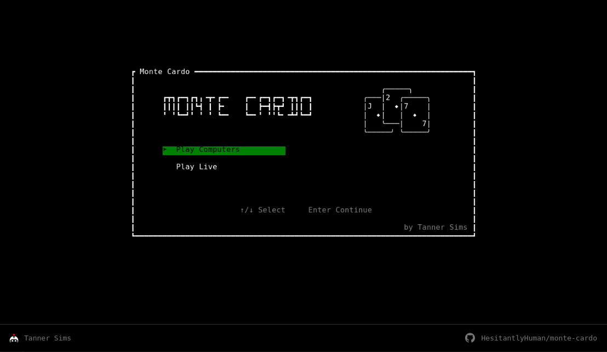
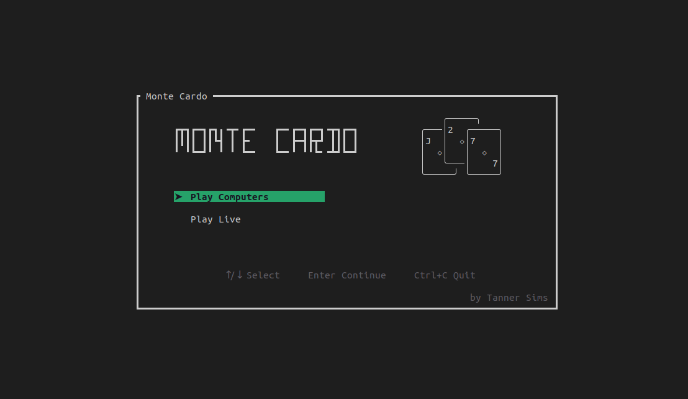

# Monte Cardo
Monte Cardo is a Monte Carlo Tree Search (MCTS) based game tree evaluator (read AI, or computer player) for ladder shedding/climbing games like [Scum](https://en.wikipedia.org/wiki/President_(card_game)) or [The Great Dalmuti](https://en.wikipedia.org/wiki/The_Great_Dalmuti).

Monte Cardo functions similarly to chess engines like AlphaGo, but where chess players have the luxury of knowing the full state of the game at any given moment, Monte Cardo is designed to evaluate the best possible move on _**expectation**_ over the possible hidden states (the opponents cards).

For more information on how Monte Cardo works, and why it was designed the way it was, please visit [my website](TODO) (Link currently broken).

## Using Monte Cardo
If you want to try out Monte Cardo for yourself, the simplest way is to visit the [web demo](https://hesitantlyhuman.github.io/monte-cardo).



If you prefer to run Monte Cardo locally, you can do that as well. You will need to clone the repository, and make sure that you have `cargo` and `rustc` installed. Then, simply navigate to the `monte-cardo-tui` crate, and run a release build.

```bash
user@host:~/.../monte-cardo$ cd crates/monte-cardo-tui
user@host:~/.../monte-cardo/crates/monte-cardo-tui$ cargo run --release
```



The two versions are mostly identical in all but some keyboard navigation commands. However, if you want to get the most performance, then it is recommended that you use the native application. You can push the solver parameters much higher if you do.

### Solver Parameters
While the Monte Cardo UI is fairly self-explanatory for the most part, the solver parameters in particular do deserve some illumination.

Below is a list of all the exposed solver parameters, and an explanation of what that parameter controls within the solver. These explanations may make more sense if you have first read the [How does it work](#how-does-it-work) section, or if you have read the various blog posts about Monte Cardo on my website.

| Setting Name                   | Explanation                                                                                                                                                                                                                                                                                         |
| ------------------------------ | --------------------------------------------------------------------------------------------------------------------------------------------------------------------------------------------------------------------------------------------------------------------------------------------------- |
| AI Suggestions and Move Values | Enables or disables move values and suggestions from being shown to the player.                                                                                                                                                                                                                     |
| AI Solver                      | Enables or disables the solver thread. Note that even if suggestions are enabled, no suggestions will be provided if the solver thread is disabled.                                                                                                                                                 |
| Search Heuristic Type          | Selects the heuristic used to create PUCT prior values during search. Actions that the heuristic ranks highly will be prioritized during search efforts and rollouts.                                                                                                                               |
| Exploration Factor             | A PUCT parameter describing how often we will look for better moves, instead of choosing moves that already look good.                                                                                                                                                                              |
| Temperature                    | Describes how randomly the solver will play. Can be viewed as a parameter describing the assumed inaccuracy or variance in the simulation. High temperature says that all moves are fairly likely, but low temperature assumes only the predicted best move will be played.                         |
| Greediness                     | Controls how much value is given to high final positions. A value of 1.0 gives a linear value schedule, so increasing your rank by one is always a fixed improvement. Values higher than 1.0 will place more importance on being first, rather than on simply avoiding last. Causes more risk play. |
| Full Tree Depth                | The depth to which we will search and evaluate every possible move. WARNING: Any value higher than 1 is highly expensive, especially for first moves.                                                                                                                                               |
| Number of Worlds to Consider   | The number of hypothetical worlds which are generated at every full tree evaluation and PUCT rollout. Each world is a different way that the opponents cards could be distributed.                                                                                                                  |
| PUCT Rollouts per Leaf         | Describes how many times we should play out the position (rollout) from a leaf + possible world.                                                                                                                                                                                                    |
| PUCT Rollout Lower Bound       | The minimum length of a PUCT rollout. Rollouts will not end early or perform state value estimates earlier than this value.                                                                                                                                                                         |
| PUCT Rollout Upper Bound       | The maximum length of a PUCT rollout. If a rollout reaches this bound, we will estimate the player values using hand size.                                                                                                                                                                          |
| PUCT Cache Size                | The maximum number of nodes permitted in the PUCT cache. Higher values will increase the speed and accuracy of the search, but use more memory.                                                                                                                                                     |
| Random Seed                    | The random seed for all RNG, can be used to replicate positions and game states.                                                                                                                                                                                                                    |

## How does it work?
Monte Cardo is a custom PUCT-based algorithm, designed specifically for playing these ladder-shedding games, similar to AlphaGo or AlphaZero.

However, Monte Cardo differs from the traditional application of game tree solvers like PUCT-based MCTS in two notable ways: First, there are generally more than 2 players in a game of Dalmuti or Scum, which prevents us from using traditional approaches like min-max.

Second, and more importantly, players of the game do not know the entire game state. Since each player's hand is hidden, it is impossible for players to deduce with certainty who has which cards.

When Monte Cardo is presented with an incomplete game state (the information available to a player at the time of play), it first samples many possible worlds: different ways that the unknown cards could be distributed among each of the opponents.

Our job, put simply, is to find which move we could choose that would provide the greatest expected value over all of these possible worlds. On average, what is our best play?

To do this, we must estimate a value (for the current player) of the current state of the game, for each of these worlds. To do so, we perform what are called "rollouts". We simply do our best to play out the rest of the game, from that position, and see how we do. Since rollouts are not that accurate, we do this a bunch of time, using previous results to guide the choices we and our hypothetical opponents make at each juncture. After a while, this can help us get a pretty good estimate of how good that position is.

For a full explanation of Monte Cardo's ins and outs, please visit [my website](TODO) (Link currently broken).

## Development
### Repository Structure
The main body of Monte Cardo consists of a set of 5 crates, located in `/crates`.

`monte-cardo-core` is, as the name suggests, the primary crate. This crate houses all the game primitives, higher order game state types, game logic, solving code and ML machinery. For the most part, any code which needs to be used in multiple places/ways (in the TUI, and in the training loops, for example), will live here.

`monte-cardo-tui` houses the types and functionality dedicated to playing and displaying Monte Cardo. This includes basic widgets for cards and hands, the main app controller, and the native and web solver thread implementations. This crate serves as a binary for the native TUI, and a library for `monte-cardo-web`.

`monte-cardo-web` is a skeleton crate which imports both `monte-cardo-core` and `monte-cardo-tui`. It contains some web specific control logic, a binary for the web solver worker, the static web page, and assets needed for the web page.

`monte-cardo-python` is a PyO3 library for python, which provides bindings for key `monte-cardo-core` functions. It is not meant to contain any implementation, but simply expose the core for use during training.

`monte-cardo-cli` is a currently unimplemented crate which will eventually house tools for running tournaments and various algorithm testing features.

### Starting the Web Service Locally
The web crate uses `trunk` to serve the static site, and relies on `monte-cardo-tui` to manage providing the correct solver thread with compile targets.

The solver worker must currently be built in release mode. Debug WASM builds can exceed the worker's available stack during search.

To run the web service locally, first ensure that you have the `wasm32` target installed:

```bash
rustup target add wasm32-unknown-unknown
```

Then, install trunk, and run the server.

```bash
cargo install --locked trunk
trunk serve --release
```

### Performance Testing
Monte Cardo uses `criterion.rs` to do performance and regression testing. To start the benchmarks, simply run the following:

```bash
cargo bench
```

### Contributing
All contributors are welcome. Feel free to reach out to me with any questions, open issues, or create pull requests with features that you want to see added to the project.

I am fairly responsive, but give me a few days to get back to you or review code.

### Further Improvements
Work on Monte Cardo is not done, and there are a couple of improvements already planned and/or in the works!

- Training a neural heuristic using self play. This requires finishing `monte-cardo-core`'s `ml` module to support batch generation, and finishing `monte-cardo-python`. Then, we can use PyTorch to train a simple model.
- Updating both modes of the UI to allow a mix of computer and human opponents. That way we can support pass-and-play.
- Setting the default seed value to `None`, and allowing Monte Cardo to generate a random seed if this is the case.